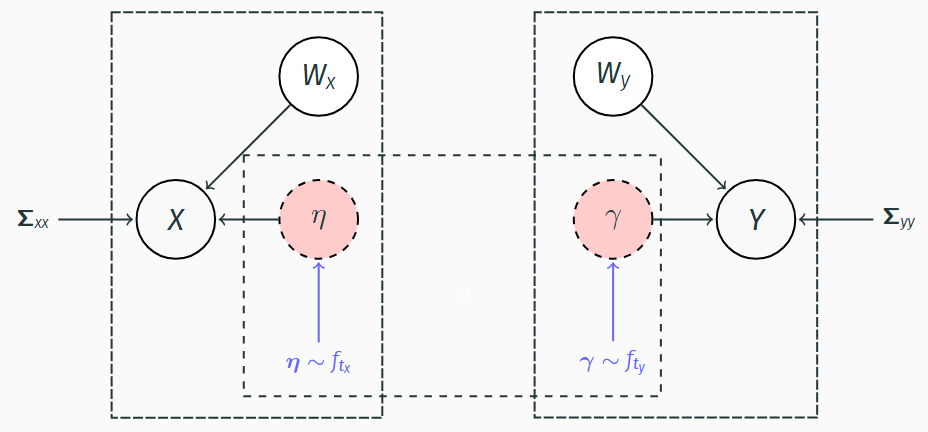

<!-- README.md is generated from README.Rmd. Please edit that file -->

```{r, include = FALSE}
knitr::opts_chunk$set(
  collapse = TRUE,
  comment = "#>",
  fig.path = "man/figures/README-",
  out.width = "100%"
)
```

# tosccamm

<!-- badges: start -->
<!-- badges: end -->

The goal of tosccamm is to ...

## Installation

You can install the development version of tosccamm like so:

``` r
devtools::install_github("nuria-sv/toscamm")
```

## TOSCCA-MM




TOSCCA-MM is a novel extension of sparse CCA that incorporates time dynamics at 
the latent variable level through longitudinal models, such as autoregressive 
models or linear mixed effect models. This approach addresses the correlation of 
repeated measurements while drawing latent paths, for each component. To aid 
interpretability and computational efficiency, we implement an $\ell_0$ penalty 
to enforce fixed sparsity levels. We estimate these trajectories fitting longitudinal 
models to the low-dimensional latent variables, (i.e.: linear mixed effects model). 
By leveraging the clustered structure of high-dimensional datasets, we are able 
to explore the shared longitudinal latent mechanisms. 
The sparse canonical weights, yield interpretable outcomes on variable contribution 
to the estimated correlated trajectories. 
Furthermore, modelling time in the latent space significantly reduces computational burden.


## Example

This is a basic example over simulated data of TOSCCA-MM

```{r load}
library(tosccamm)

# for plots
library(grid)
library(ggplot2)
library(gridExtra)
```

```{r simulate data, include=FALSE}
n = 100

#This can be varied to simulate different signals
alpha1 = c(rep(0.5,10), rep(0, 990))
beta1 = c(rep(0.5,5), rep(0, 195))
alpha2 = c(rep(0, 990), rep(0.5,10))
beta2 = c(rep(0, 195), rep(0.5,5))

X1 = list()
X2 = list()

i = 1
K = 1
sg = matrix(c(1, 0.6, 0.3, rep(0, 7), 0.6, 1, 0.6, 0.3, 
              rep(0, 6), 0.3, 0.6, 1, 0.6, 0.3, 
              rep(0,5), 0, 0.3, 0.6, 1, 0.6, 0.3, 
              rep(0, 4), rep(0, 2), 0.3, 0.6, 1, 0.6, 0.3, 
              rep(0,3), rep(0,3), 0.3, 0.6, 1, 0.6, 0.3, rep(0, 2), 
              rep(0, 4), 0.3, 0.6, 1, 0.6, 0.3, 0, 
              rep(0, 5), 0.3, 0.6, 1, 0.6, 0.3, rep(0,6), 0.3, 0.6, 1, 0.6, 
              rep(0,7), 0.3, 0.6, 1), ncol = 10)

for(i in 1:n)
{
  print(i)
  #Simulate  times of measurement
  times = 1:10

  #random effect
  ui = rnorm(1,0,0.25)

  #Shared canonical vector (with some time effect)
  Zi1 = -(1+times/max(times))^3 + times * 0.5 + ui
  Zi2 = (sin(100*times))^times +   times * 0.65 +rnorm(1,0,0.6)

  Zi = cbind(Zi1, Zi2)
  alpha = cbind(alpha1, alpha2)
  beta = cbind(beta1, beta2)

  #Simulate data and add some noise
  X1i = sapply(1:nrow(alpha), function(a) MASS::mvrnorm(1, (Zi %*% t(alpha))[,a], Sigma = sg))
  X2i = sapply(1:nrow(beta), function(a) MASS::mvrnorm(1, (Zi %*% t(beta))[,a], Sigma = sg))
  # X1i = sapply(alpha1, function(a) rnorm(length(times), Zi1 * a, 0.5))
  # X2i = sapply(beta1, function(a) rnorm(length(times), Zi1 * a, 0.5))
  # X1i = sapply(alpha2, function(a) rnorm(length(times), Zi2 * a, 0.5))
  # X2i = sapply(beta2, function(a) rnorm(length(times), Zi2 * a, 0.5))
  colnames(X1i) = paste0("X", 1:ncol(X1i))
  colnames(X2i) = paste0("Y", 1:ncol(X2i))

  #Check the simulated cross correlation
  #image(cor(X1i, X2i))

  #Remove some observations
  # p_observed = 1
  X1i = cbind(id=i, time=times, X1i)#[rbinom(length(times),1,p_observed)==1,]
  X2i = cbind(id=i, time=times, X2i)#[rbinom(length(times),1,p_observed)==1,]


  X1[[i]] = X1i
  X2[[i]] = X2i
}

X1 = do.call("rbind", X1)
X2 = do.call("rbind", X2)
dev.new(); image(cor(X1,X2))


verwijder_X = sample(1:nrow(X1), 0.2*nrow(X1), replace=FALSE)
verwijder_Y = sample(1:nrow(X2), 0.3*nrow(X2), replace=FALSE)
table(verwijder_X)
table(verwijder_Y)
X1=X1[-verwijder_X,]
X2=X2[-verwijder_Y,]
# XX2 = scale_rm(data.frame(X1), centre = T); YY2 = scale_rm(data.frame(X2), centre = T)
XX2 = data.frame(X1); YY2 = data.frame(X2)
nonz_a = seq(50, 5, length.out = 10) # seq(100, 1000, 100)
nonz_b = round(seq(50, 5, length.out = 5)) # seq(100, 1000, 100)
```


Estimate the canonical weights and latent paths for $K$ components.
```{r estimate tosccamm}
res_k = list()

X.temp = XX2
Y.temp = YY2
for (k in 1:K) {
  if(k > 1) {
    # residualise for subsequent components
    X.temp = data.frame(X.temp[,c(1,2)],toscca::residualisation(as.matrix(X.temp[,-c(1,2)]), res_k[[k-1]]$alpha, type = "basic") )
    Y.temp = data.frame(Y.temp[,c(1,2)],toscca::residualisation(as.matrix(Y.temp[,-c(1,2)]), res_k[[k-1]]$beta, type = "basic") )

    nz_a_gen = as.numeric(table(res_k[[k-1]]$alpha != 0)[2])
    nz_b_gen = as.numeric(table(res_k[[k-1]]$beta != 0)[2])
  }

  res_k[[k]] <- tosccamm(X.temp, Y.temp, folds = 2,
                                            nonzero_a = nonz_a, nonzero_b = nonz_b,
                                            model = "lme", lmeformula = " ~ 0 + poly(time,3) + (1|id)")

}
```


Plot results
```{r plots, include=FALSE}
lv1 = data.frame(id = XX2$id, time = XX2$time, K1=as.matrix(XX2[,-c(1,2)])%*% (res_k[[1]]$alpha))
lv2 = data.frame(id = XX2$id, time = XX2$time, K2=as.matrix(XX2[,-c(1,2)])%*% (res_k[[2]]$alpha))
lv3 = data.frame(id = XX2$id, time = XX2$time, K3=as.matrix(XX2[,-c(1,2)])%*% (res_k[[3]]$alpha))

shed_blue_60 <- "#6864fc"

# Update plot1 (no x-axis label)
plot1 <- ggplot(lv1, aes(x = time, y = scale(K1), group = id)) +
  geom_line(alpha = 0.1, aes(color = "Estimated", linetype = "Estimated", linewidth = "Estimated")) +  # Estimated (black)
  geom_line(data = data.frame(time = sort(unique(lv1$time)), z = scale(Zi2)), aes(x = time, y = scale(z), color = "True", group = 1, , linetype = "True", linewidth = "True")) +  # True (red)
  geom_line(data = data.frame(time = sort(unique(lv1$time)), K1 = aggregate(lv1, by = list(lv1$time), FUN = mean)$K1), aes(x = time, y = scale(K1), group = 1, color = "Smoothed", linetype = "Smoothed", linewidth = "Smoothed")) +  # Smoothed (blue)
  scale_color_manual(values = c("Estimated" = "black", "True" = "red", "Smoothed" = shed_blue_60)) +  # Specify color manually
  scale_linewidth_manual(values =c("Estimated" = 0.8, "True" = 1.5, "Smoothed" = 1.5)) +
  scale_linetype_manual(values = c("Estimated" = 3, "True" = 1, "Smoothed" = 2)) +  # Specify line types
  scale_x_continuous(breaks = unique(lv1$time)) +  # Ensure x-axis is integers
  labs(x = "Time", y = "Values", color = "Legend" ) +  # Remove x label
  theme_minimal() +
  theme(legend.position = "none",
        text = element_text(family = "Latex"),
        axis.title.y = element_text(size = 20, margin = margin(r = 10)),  # Increase Y axis title size
        axis.title.x = element_text(size = 20, margin = margin(t = 15)),
        axis.text = element_text(size = 15),     # Increase axis text size
        plot.title = element_text(size = 25),    # Increase plot title size
        axis.text.x =element_text(size = 15)    # Increase X axis text size
  )
# Update plot2 (include x label)
plot2 <- ggplot(lv2, aes(x = time, y = scale(K2), group = id)) +
  geom_line(alpha = 0.1, aes(color = "Estimated", linetype = "Estimated", linewidth = "Estimated")) +  # Estimated (black)
  geom_line(data = data.frame(time = sort(unique(lv2$time)), z = scale(Zi1)), aes(x = time, y = scale(z), color = "True", group = 1, linetype = "True", linewidth = "True")) +  # True (red)
  geom_line(data = data.frame(time = sort(unique(lv2$time)), K2 = aggregate(lv2, by = list(lv2$time), FUN = mean)$K2), aes(x = time, y = scale(K2), group = 1, color = "Smoothed", linetype = "Smoothed", linewidth = "Smoothed")) +  # Smoothed (blue)
  # geom_smooth(data = lv2, aes(x = time, y = scale(K2), group = 1, color = "Smoothed", linetype = "Smoothed", linewidth = "Smoothed"), se = FALSE) +  # Smoothed (blue)
  scale_color_manual(values = c("Estimated" = "black", "True" = "red", "Smoothed" = shed_blue_60)) +  # Specify color manually
  scale_linewidth_manual(values =c("Estimated" = 0.8, "True" = 1.5, "Smoothed" = 1.5)) +
  scale_linetype_manual(values = c("Estimated" = 3, "True" = 1, "Smoothed" = 2)) +  # Specify line types
  scale_x_continuous(breaks = unique(lv2$time)) +  # Ensure x-axis is integers
  labs(x = "Time", y = "", color = "Legend") +  # Add x label for bottom plot
  theme_minimal() +
  theme(legend.position = "none",
        text = element_text(family = "Latex"),
        axis.title.y = element_text(size = 20, margin = margin(r = 10)),  # Increase Y axis title size
        axis.title.x = element_text(size = 20, margin = margin(t = 15)),
        axis.text = element_text(size = 15),     # Increase axis text size
        plot.title = element_text(size = 25),    # Increase plot title size
        axis.text.x = element_text(size = 15)    # Increase X axis text size
  )
plot3 <- ggplot(lv3, aes(x = time, y = scale(K3), group = id)) +
  geom_line(alpha = 0.1, aes(color = "Estimated", linetype = "Estimated", linewidth = "Estimated")) +  # Estimated (black)
  geom_hline(yintercept =0, color = "red", linetype = 1, linewidth = 1.5) +
  geom_smooth(data = lv3, aes(x = time, y = scale(K3), group = 1, color = "Smoothed", linetype = "Smoothed", linewidth = "Smoothed"), se = FALSE) +  # Smoothed (blue)
  scale_color_manual(values = c("Estimated" = "black", "True" = "red", "Smoothed" = shed_blue_60)) +  # Specify color manually
  scale_linewidth_manual(values =c("Estimated" = 0.8, "True" = 1.5, "Smoothed" = 1.5)) +
  scale_linetype_manual(values = c("Estimated" = 3, "True" = 1, "Smoothed" = 2)) +  # Specify line types
  scale_x_continuous(breaks = unique(lv3$time)) +  # Ensure x-axis is integers
  labs(x = "Time", y = "Values", color = "Legend" ) +  # Remove x label
  theme_minimal() +
  theme(legend.position = "none",
        text = element_text(family = "Latex"),
        axis.title.y = element_text(size = 20, margin = margin(r = 10)),  # Increase Y axis title size
        axis.title.x = element_text(size = 20, margin = margin(t = 15)),
        axis.text = element_text(size = 15),     # Increase axis text size
        plot.title = element_text(size = 25),    # Increase plot title size
        axis.text.x =element_text(size = 15)    # Increase X axis text size
  )

# Create a shared legend
shared_legend <- ggplot(lv1, aes(x = 1, y = 0, group = id)) +
  geom_line(aes(color = "Estimated", linetype = "Estimated", linewidth = "Estimated")) +
  geom_line(aes(color = "True", , linetype = "True", linewidth = "True")) +
  geom_line(aes(color = "Mean", linetype = "Mean", linewidth = "Mean")) +
  scale_color_manual(values = c("Estimated" = "black", "True" = "red", "Mean" = shed_blue_60)) +
  scale_linewidth_manual(values =c("Estimated" = 1, "True" = 1, "Mean" = 1)) +
  scale_linetype_manual(values = c("Estimated" = 3, "True" = 1, "Mean" = 2)) +  # Specify line types
  labs(color = "Legend", linetype = "Legend", linewidth ="Legend") +theme_void() +
  theme(legend.position = "top", legend.title = element_blank(), legend.text = element_text(size =20), text = element_text(family = "Latex"))


grid.arrange(
  gridExtra::arrangeGrob(
    plot1,
    plot2,
    ncol = 2  # Stack plot1 and plot2 vertically
  ),
  shared_legend,
  nrow = 2,  # Arrange the legend in the second row
  heights = c(4, 0.4)  # Adjust the height ratio between the plots and the legend
)
```

