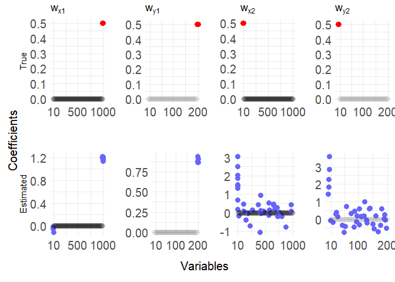

<!-- README.md is generated from README.Rmd. Please edit that file -->

# tosccamm

<!-- badges: start -->


<!-- badges: end -->

_tosccamm_ is the package to implement the Thresholded Ordered Sparse CCA for Multiple Measurements (TOSCCA-MM) method described in Senar, et al., ?? (paper not yeat available).

## Installation

You can install the development version of tosccamm like so:

``` r
devtools::install_github("nuria-sv/toscamm")
```

## TOSCCA-MM


TOSCCA-MM is a novel extension of sparse CCA that incorporates time
dynamics at the latent variable level through longitudinal models, such
as autoregressive models or linear mixed effect models. This approach
addresses the correlation of repeated measurements while drawing latent
paths, for each component. To aid interpretability and computational
efficiency, we implement an $\ell_0$ penalty to enforce fixed sparsity
levels. We estimate these trajectories fitting longitudinal models to
the low-dimensional latent variables, (i.e.: linear mixed effects
model). By leveraging the clustered structure of high-dimensional
datasets, we are able to explore the shared longitudinal latent
mechanisms. The sparse canonical weights, yield interpretable outcomes
on variable contribution to the estimated correlated trajectories.
Furthermore, modelling time in the latent space significantly reduces
computational burden.

## Example

This is a basic example over simulated data of TOSCCA-MM

``` r
library(tosccamm)

# for plots
library(grid)
library(ggplot2)
library(gridExtra)
```

Estimate the canonical weights and latent paths for $K$ components.

``` r
res_k = list()

X.temp = XX2
Y.temp = YY2
for (k in 1:K) {
  if(k > 1) {
    # residualise for subsequent components
    X.temp = data.frame(X.temp[,c(1,2)],toscca::residualisation(as.matrix(X.temp[,-c(1,2)]), res_k[[k-1]]$alpha, type = "basic") )
    Y.temp = data.frame(Y.temp[,c(1,2)],toscca::residualisation(as.matrix(Y.temp[,-c(1,2)]), res_k[[k-1]]$beta, type = "basic") )

    nz_a_gen = as.numeric(table(res_k[[k-1]]$alpha != 0)[2])
    nz_b_gen = as.numeric(table(res_k[[k-1]]$beta != 0)[2])
  }

  res_k[[k]] <- tosccamm(X.temp, Y.temp, folds = 2,
                                            nonzero_a = nonz_a, nonzero_b = nonz_b,
                                            model = "lme", lmeformula = " ~ 0 + poly(time,3) + (1|id)")

}
#> Loading required package: Matrix
#> Registered S3 method overwritten by 'quantmod':
#>   method            from
#>   as.zoo.data.frame zoo
#>  Common convergence error: 0 & Iterations: 5  Common convergence error: 0 & Iterations: 5 
#> k-fold cv max. cancor 
#>             0.9992169 
#> 
#>  ........................................ 
#>  # nonzero A: 15
#>  # nonzero B: 5
#>  ........................................
```


    #>  Common convergence error: 0.04707 & Iterations: 21  Common convergence error: 0.05388 & Iterations: 21 
    #> k-fold cv max. cancor 
    #>              0.986778 
    #> 
    #>  ........................................ 
    #>  # nonzero A: 40
    #>  # nonzero B: 39
    #>  ........................................


    #>  Common convergence error: 0.03885 & Iterations: 21  Common convergence error: 0.03053 & Iterations: 21 
    #> k-fold cv max. cancor 
    #>             0.9577028 
    #> 
    #>  ........................................ 
    #>  # nonzero A: 30
    #>  # nonzero B: 5
    #>  ........................................


### Results

#### Latent paths for $k=1$ and $k=2$


#### Canonical weights for $k=1$ and $k=2$



#### Latent path and canonical weights for $k=3$, noise


